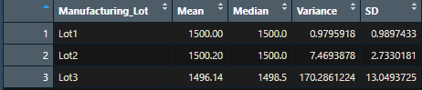
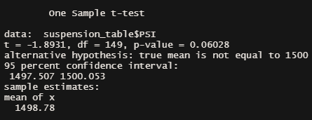
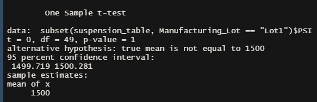
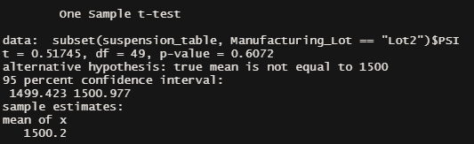
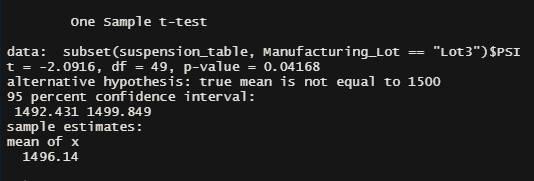

# MechaCar Statistical Analysis
A statistic analysis of particular metrics of the AutosRUs MechaCar to enable manufacturing progress

## Overview

The new MechaCar from AutosRUs is suffering from troubles in production. The goal of this analytical review is to help relieve those troubles by:
 - discovering which variables pedict the Miles Per Gallon for prototype vehicles;
 - collect summary stats on the PSI of suspension coils;
 - determine what statistical differences, if any, are present among manufacturing lots from the mean;
 - design a study to compare success factors of other manufacturer vehicles against MechaCar performance

## Results

### Linear Regression to Predict MPG

 
 - With p-values of `2.6x10⁻¹²` and `5.21x10⁻⁸`, *Vehicle Length* and *Ground Clearance* are, respectively, the two most statistically significant factors in our dataset that affected the MPG of the MechaCar. The other variables do not seem to be statistically significant at all according to our model. However, the intercept is also statistically significant, indicating there may be other factors affecting our MPG that we did not measure.
 - The null hypothesis must be rejected, as the p-value for the linear model is `5.35x10⁻¹¹`. This is lower than an extreme level of significance, meaning at least some of our variables do have a significant impact on the MPG and cannot be attributed to random chance.
 - The model is 71% accurate, as noted by the R-Squared value of `0.7149`. It can accurately predict the MPG performance of the MechaCar, though there is room for improvement, likely by locating even more statistically significant variables.

### Summary Statistics on Suspension Coils

 - For all manufacturing lots in total, the variance does not exceed the 100 PSI limit, though it is on the high side at 62 PSI. 
 - This can be explained by the Lot summary, as manufacturing Lot 3 has an extremely high variance of 170 PSI, putting that lot well outside standards compared to Lots 1 and 2. Lot 3's Suspension Coils need to be rejected.

### T-Tests on Suspension Coils

**All Lots against mean 1500 PSI**
 

 - The results of the t-Test indicate that the mean PSI for suspension coils across all lots is not statistically different from the population mean, and the p-value is not low enough for us to reject the null hypothesis.

**Lot 1 against mean 1500 PSI**
 

 - The results of the t-Test indicate that the mean PSI for suspension coils in Lot 1 is not statistically different from the population mean, and the p-value is not low enough for us to reject the null hypothesis.

**Lot 2 against mean 1500 PSI**
 

 - The results of the t-Test indicate that the mean PSI for suspension coils in Lot 2 is not statistically different from the population mean, and the p-value is not low enough for us to reject the null hypothesis.

**Lot 3 against mean 1500 PSI**
 

 - The results of the t-Test indicate that the mean PSI for suspension coils in Lot 3 is slightly statistically different than the population mean, and the p-value is low enough (0.04168) that we can reject the null hypothesis. Lot 3 should be discarded or re-evaluated.

## Study Design: MechaCar vs Competition

When considering consumer needs for the MechaCar, it may be helpful to consider what it can do to beat out the competition not at the individual level, but at the *fleet* level. A large portion of our sales may come from ridesharing or otherwise large-volume companies that need many consistent and reliable vehicles. With a large number of vehicles, maintenance costs can add up, therefore we should test and gear our production toward reducing the costs of maintenance.

### Metric to Test

Our test will measure average maintenance costs (in $USD) per year for the MechaCar versus the competition's vehicles average maintenance per year.

### Hypotheses

 - H₀: MechaCar average annual maintenance costs are similar to competitor vehicles in the same vehicle class.
 - Hₐ: MechaCar average annual maintenance costs are statistically above or below that of competitor vehicles.

 ### Statistical Test Used

 To compare these mean values, we would use two-sample t-Tests

 ### Data required

 We would need to gather, likely through survey of large fleet owners, the average maintenance cost per year of their current fleets versus the cost of a fleet of MechaCars.